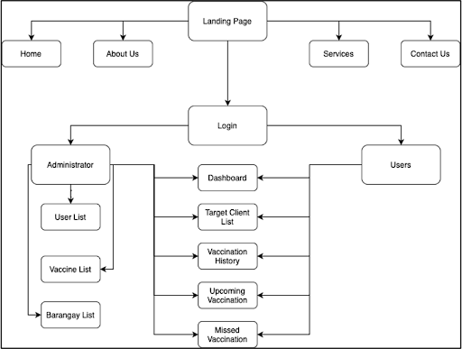
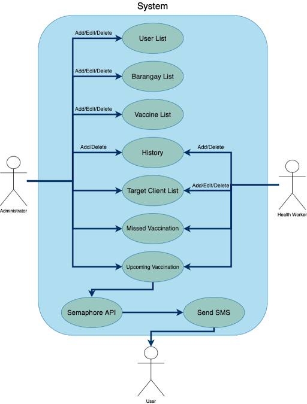

# :syringe: CAREPATH

Carepath is a blockchain enabled infant immunization registry equipped with an SMS reminder system and QR code system. This system can be implemented in different cities here in the Philippines, which until now have used the traditional handling and monitoring of immunization records. This system will improve the traditional handling of immunization records and the monitoring of the vaccination schedule using SMS messaging notification, thereby reducing the risks for infants of having vaccine-preventable diseases and reducing the infant’s morbidity rate. The <i>"path"</i> in the project title <i>"Carepath"</i> underscores the intentional journey towards recognizing blockchain's broader applications beyond cryptocurrency, especially in the realm of healthcare. This project can demonstrate the effectiveness of using blockchain to our healthcare systems and can serve as a mainspring for creating more blockchain based systems and services in the Philippines.

<h6>This project would benefit various stakeholders, including but not limited to:</h6>

- :derelict_house:<b>Government:</b> Change the perspective of the government on the blockchain's utility for positive purposes.
- :baby:<b>Infants:</b> The system boosts infant immunization rates in Angeles City, reducing disease risks.
- :man_office_worker:<b>Health Service Officers:</b> The system delivers health services efficiently through an electronic database and SMS reminders, potentially informing the development of other electronic health systems.
- :family_man_woman_boy:<b>Parents:</b> It empowers parents with timely immunization information, enhancing their confidence in accessing modern health services.
- :woman_health_worker:<b>Health Workers:</b> It offers a user-friendly tool for monitoring infant immunization, potentially reducing workloads and increasing productivity.
- :student:<b>Student-interns</b> deployed in health centers or offices could also benefit from the system.

<h6>Live Canister Link: [put here]</h6>

<h2>Introduction</h2>

Carepath provides a comprehensive solution to track and manage infant immunizations through a user-friendly web application and mobile app. The application simplifies the process of keeping infants up-to-date on critical immunizations. The system offers robust data management and reminders to enhance vaccination compliance, preventing missed appointments. Carepath empowers healthcare providers with a modern solution, providing parents or guardians with peace of mind.

<h6>Key Features</h6>

- SMS reminders for upcoming vaccinations sent directly to parents/guardians
- Online registry for recording vaccination details
- Mobile app for parents or guardians to view immunization records on-the-go
- Intuitive interface and easy-to-use platform for health workers
- QR code scanning to easily create the infant data from parents to the system.
- Exporting to Excel Function is done to automate the transferring of the data.

<h6>Site Map:</h6>



<h6>Use Case Diagram:</h6>



<h2>Installation</h2>

Step-by-step guide to get a copy of the project up and running locally for development and testing.

<h6>Prerequisites</h6>

- Install node.js v16.20.2 <a href="https://nodejs.org/dist/v16.20.2/">Click here to install</a>
- Install git <a href="https://git-scm.com/downloads">Click here to install</a>

<h6>Install</h6>

```bash
$ git clone <GitHub repo>
$ cd <project>
$ npm install
$ dfx start --background
$ dfx deploy
```

<h2>License</h2>
This project is licensed under the MIT license, see LICENSE.md for details.

<h2>Acknowledgements</h2>

- Government of Angeles City
- Angeles City Health Office
- AUF College of Nursing
- AUF College of Computer Studies
- Internet Computer Protocol

<h2>References</h2>

- [Internet Computer](https://internetcomputer.org)
